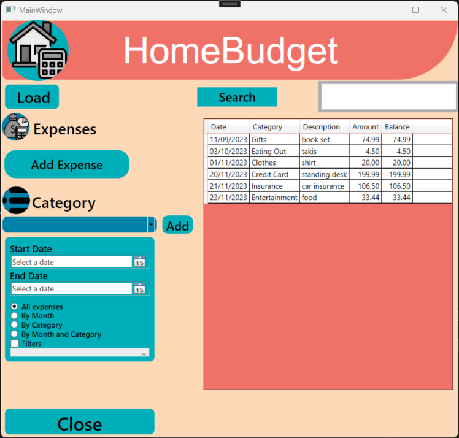

# Joe-HomeBudget

The Budget App is a group project, that I worked on throughout my fourth semester in my application development class. This windows application is uses to allow the user to track their various purchase and income by categorizing them. This app allows the user to manage their budget and see what they spend the most money on.

These Joe-HomeBudget uses sql-server to keep track of the user information when the application in running or not. This database is on the client side. you can or create a new database or use a previous one:

then when the user selected or created a new database they are introduce with the default page of the application, which is like the center of this application that allows the user to preview everything they have, let them add expenses and categories.

then when you click to add expenses it allows you to add a given expenses that has to have these specific criterias:

- Date
- Category (which is a dropdown, but you can alway add new category)
- Amount
- Description

then if the default category aren't specific enough for you. You can always add a new category. a given Gategory has 2 criteria:
- a Name
- A category Type (which is a choice between: Income,Expense,Credit,Savings)

then after adding the different category or expense you can always go back to the default screen, where you can see your different expense being added:

where you can also filter your expenses:

## Filter By Month

## Filter By Category

## Filter By Month And Category

## Filter By A Specific Category

you can also use the search feature if you have a long list of expense and are looking for a specific one:
